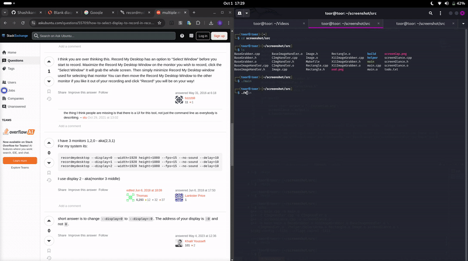
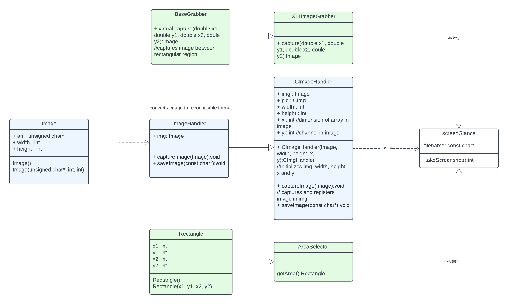

# SCREENGLANCE


## Overview 
This project is a screenshot capturing tool that allows users to take screenshots of specific rectangular areas on their screen in their linux with X11 system. The tool leverages the X11 system to capture the screen region, processes the image, and saves it in a recognizable format.

## Features
* Custom Area Selection: Allows the user to define a specific rectangular area on the screen for capturing.
* Image Processing: Captures, processes, and saves images using various handlers.
* X11 System Integration: Utilizes X11 for capturing screen regions on systems that support X11.
* Can be extended for wayland/windows

## Requirements
Linux\
X11 Window System\
C++ Compiler\
X11 Library \
CImg library\
cairo library

## Class Diagram


## Getting Started
* Clone the repository:

```<bash>
git clone https://github.com/Shashikantthakur329/screenGlance.git
```

* Build the project using a C++ compiler with provided Makefile.

* Run the executable.

* After running the executable, select a rectangular region in your screen.

## Controls
* Use the AreaSelector to define a rectangular region on the screen.
* Run the takeScreenshot() method to capture the defined region.

## Acknowledgments
* [X11 Library](https://www.x.org/releases/X11R7.5/doc/libX11/libX11.html): Used for accessing screen regions.
* [Cimg Library](https://cimg.eu/reference/)
* [cairo Library](https://www.cairographics.org/)

## Contributing
Feel free to contribute to the project by opening issues or pull requests.